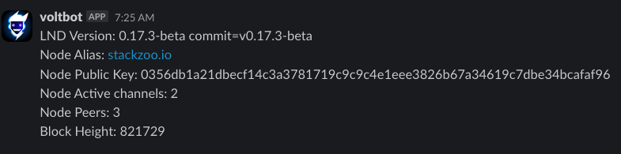

# VOLTBOT
[](https://github.com/stackzoo/voltbot/actions/workflows/oci.yaml)
[](https://github.com/stackzoo/voltbot/releases/latest)
[](https://goreportcard.com/report/github.com/stackzoo/voltbot)
[](https://opensource.org/licenses/MIT)  


Lightning node bot ⚡🤖

### Supported Products

- [Slack](https://slack.com/)

### Supported Lightning Nodes Implementations

- [LND](https://github.com/lightningnetwork/lnd)

## Abstract
Voltbot is a lightweight bot that retrieves lightning node stats and send them via different channels.  
This can be beneficial for monitoring node instances.  
Voltbot communicates with the *LND* instance through [gRPC](https://grpc.io/).  


## Instructions

To operate, the bot requires reading configuration data from a JSON file.  
The configuration file must be located within the `config` folder at the root directory and must be named `voltbot_config.json`.  
You can take a look at the example file inside the `config` folder:  
```json
{
    "lnd_node_endpoint": "<node-endpoint:port>",
    "lnd_node_tls_cert_path": "config/tls.cert",
    "lnd_node_macaroon_hex_path": "config/macaroon.hex",
    "slack_channel_id": "<slack-channel-id>",
    "slack_token": "<slack-token>"
}
```  
At present, the retrieval of statistics is hard-coded to occur every *360 minutes* (6 hours).  

### Run with docker
The project includes a GitHub Action that publishes an OCI image (container) to the GitHub registry when a new version is tagged.  
Consequently, it is possible to run the project directly as a container.  
  
  
Pull the image:  
```console
docker pull ghcr.io/stackzoo/voltbot:0.0.2
```  
And the run the container by mapping the local folder that contains the configuration files:  
```console
docker run -v "/your/local/config/path/config:/config" ghcr.io/stackzoo/voltbot:0.0.2
```  

>[!Note]
> You can also pull the Image compiled for ARM architecture, for example if you want to run the bot on a raspberry pi or another edge device.  
> In order to do that you just need to use the "-arm" tag, for example: `docker pull ghcr.io/stackzoo/voltbot:0.0.5-arm`


## Example




